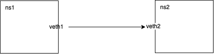

# network namespace 互连

在 linux 中的容器化上，一定会使用到 linux network namespace 用来做容器之间的网络隔离。那么在 linux 中怎么实现一个让 network namespace
互联呢？这就是这个小 blog 的主要话题。也是最近在学习 kubernetes CNI 引出的一个小话题。

## 两个 network namespace 互连

这个小实验使用 veth pair 直接让两个 network namespace 互联，类似于直接使用一根网线把两台电脑 💻 直接连接，这样这两个电脑就可以互相通信。
这里使用 ICMP(ping) 来验证连通性。



```shell
## 创建两个网络命名空间
ip netns add ns1
ip netns add ns2

## 创建一对虚拟以太网设备，并将每个设备连接到一个命名空间
ip link add veth1 type veth peer name veth2
ip link set veth1 netns ns1
ip link set veth2 netns ns2

## 在每个命名空间中配置网络接口
ip netns exec ns1 ip addr add 192.168.1.1/24 dev veth1
ip netns exec ns1 ip link set veth1 up

ip netns exec ns2 ip addr add 192.168.1.2/24 dev veth2
ip netns exec ns2 ip link set veth2 up

## 在每个网络命名空间中配置默认路由
ip netns exec ns1 ip route add default via 192.168.1.2
ip netns exec ns2 ip route add default via 192.168.1.1

## ---------------------------------------

## teardown
ip netns del ns1
ip netns del ns2
```

## 两个 network 通过 veth 连接到同一个 network bridge 上

在 linux 中有一个叫做 network bridge 的网络组件，绑定在同一个 bridge 上的 veth 可以互相访问。


```shell
## 安装 brictl, iptables
apt install iproute2 bridge-utils iptables -y

## 创建两个网络命名空间
ip netns add ns1
ip netns add ns2

## 创建一个网桥
brctl addbr br0

## 为网桥添加 IP 地址，并启用
ip addr add 192.168.1.254/24 dev br0
ip link set dev br0 up

## 将虚拟设备 veth1 和 veth2 分别添加到两个网络命名空间中
ip link add veth1 type veth peer name veth1-br
ip link set veth1-br up

ip link add veth2 type veth peer name veth2-br
ip link set veth2-br up

## 将虚拟设备 veth1-br 和 veth2-br 分别添加到网桥 br0 中
brctl addif br0 veth1-br
brctl addif br0 veth2-br

## 在每个命名空间中配置网络接口
ip link set veth1 netns ns1
ip netns exec ns1 ip addr add 192.168.1.1/24 dev veth1
ip netns exec ns1 ip link set veth1 up

ip link set veth2 netns ns2
ip netns exec ns2 ip addr add 192.168.1.2/24 dev veth2
ip netns exec ns2 ip link set veth2 up

## 由于 iptables 会禁止访问，需要开启(暂时不知道为啥)
iptables -A FORWARD -i br0 -j ACCEPT

## 设置默认路由，让网桥作为网关
ip netns exec ns1 ip route add default via 192.168.1.254
ip netns exec ns2 ip route add default via 192.168.1.254

## -------------------------

## teardown
iptables -D FORWARD -i br0 -j ACCEPT
ip netns del ns1
ip netns del ns2
ip link del br0
```

### Note

tcpdump: 用来抓对应 network interface 的请求，常用的 options

- -p: Don't put the interface into promiscuous mode.(暂时不知道什么是混杂模式 promiscuous mode)
- -n: Don't convert addresses (i.e., host addresses, port numbers, etc.) to names.
- -e: Print the link-level header on each dump line.  This can be used, for example, to print MAC layer addresses for 
  protocols such as Ethernet and IEEE 802.11.
