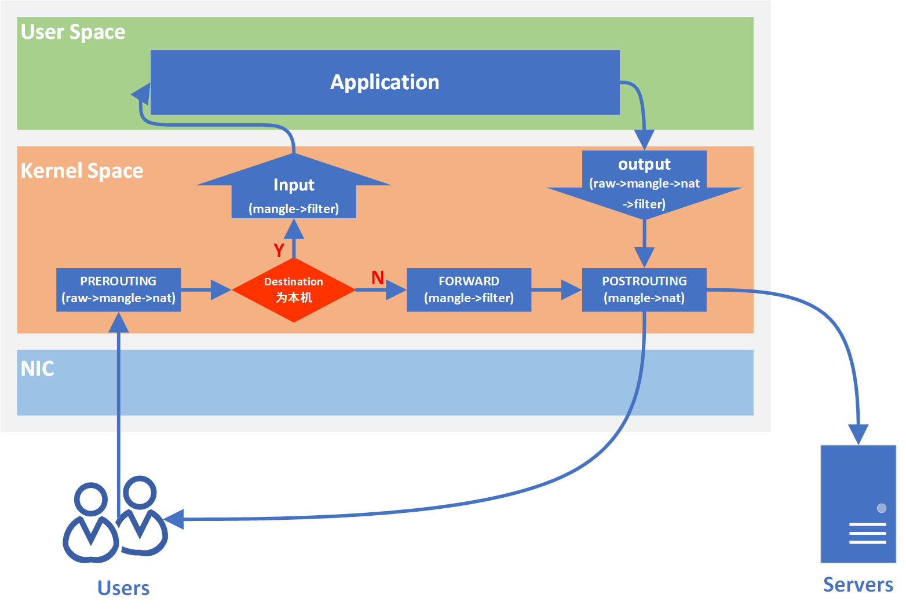

# 认识 Linux iptables

IPTABLES 是与最新的 3.5 版本 Linux 内核集成的 IP 信息包过滤系统。如果 Linux 系统连接到因特网或 LAN、服务器或连接 LAN 和因特网的代理服务
器，则该系统有利于在 Linux 系统上更好地控制 IP 信息包过滤和防火墙配置。

同时 iptables 也是 kubernetes 中内置的网络连接方式(我记得是)。

## iptables 4表五链

在 Linux 中，iptables 是一个用于配置 IPv4 数据包过滤规则的工具。iptables 使用表（tables）和链（chains）的概念来组织规则。IPv4 的 
iptables 支持四个表，每个表包含若干个链。这四个表分别是：filter、nat、【mangle 和 raw】(不常用)。



1. filter 表:
   - Chains:
     - INPUT: 用于处理传入的数据包。
     - FORWARD: 用于处理通过系统的数据包。
     - OUTPUT: 用于处理本地生成的数据包。
2. nat 表:
   - Chains:
     - PREROUTING: 在数据包进入路由之前处理，用于目标地址转换。
     - POSTROUTING: 在数据包离开路由之后处理，用于源地址转换。
     - OUTPUT: 用于本地生成的数据包的目标地址转换。
3. mangle 表:
   - Chains:
     - PREROUTING: 在数据包进入路由之前处理。
     - INPUT: 处理传入的数据包。
     - FORWARD: 处理通过系统的数据包。
     - OUTPUT: 处理本地生成的数据包。
     - POSTROUTING: 在数据包离开路由之后处理。
4. raw 表:
   - Chains:
     - PREROUTING: 在数据包进入路由之前处理，不会跟跟踪状态或连接。
     - OUTPUT: 用于处理本地生成的数据包，不会跟踪状态或连接。

```shell
# 可以使用 iptables 命令查看
# -n: Numeric output.  IP addresses and port numbers will be printed in numeric format.  By default, the program 
#     will try to display them as  host  names,  network names, or services (whenever applicable).
# -L: List all chains.
iptables -nL

# 限制从 192.168.56.10 来的所有请求
# -t: specific which table
# -I: insert rule into the selected chain
# -s: source ip
# -j: target(ACCEPT, DROP, REJECT)
# 默认会加到当前 chain 的第一个
iptables -t filter -I INPUT -s 192.168.56.10 -j DROP
# -D: delete one or more rule from the selected chain
iptables -t filter -D INPUT 1

# 限制从 192.168.56.10 访问 80 端口
# -p: protocol, The specified protocol can be one of tcp, udp, udplite, icmp, icmpv6,esp, ah, sctp, mh  or  the
#     special keyword "all".
# --dport: destination port.
iptables -t filter -I INPUT -s 192.168.56.10 -j DROP -p tcp --dport 80

# 多个端口
iptables -t filter -I INPUT -s 192.168.56.10 -j DROP -p tcp -m mutiport --dport 80,443

# 连续的端口范围: 1 - 1024
iptables -t filter -I INPUT -s 192.168.56.10 -j DROP -p tcp--dport 1:1024
```

## Linux 内核参数

Linux 内核参数配置文件在 `/etc/sysctl.conf`，每次修改之后，需要运行 `sysctl -p` 生效

临时修改内核参数，所有的参数都是一个文件，在 `/proc/sys/` 文件夹中，例如 `net.ipv4.icmp_echo_ignore_all` 配置所对应的文件是：
`/proc/sys/net/ipv4/icmp_echo_ignore_all`

查看所有内核参数: `sysctl -a`
